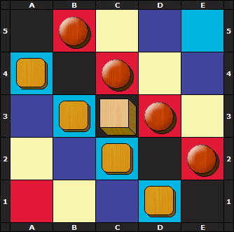

# Period-5

## Elementos 
> João Pedro Oliveira Sequeira - up202108823
> Tiago Rocha Silveira Pires - up202008790

# Instalação e Execução
> Para executar o jogo é necessário fazer *consult* do ficheiro menu.pl e depois executar "play.".

# Descrição do jogo
> O Period_5 é jogado num tabuleiro 5x5 com quadrados pintados em 5 cores.
> Existem dois jogadores, cada um com 4 peças. Há também uma peça adicional - o cubo.
> A coloração do tabuleiro e a posição inicial das peças e do cubo são mostradas na imagem a seguir:

### **Movimentação** - Todas as peças e o cubo são capazes de se mover ortogonalmente por qualquer número de espaços vazios. Eles não podem pular outras peças ou cair numa casa ocupada.
> Quando o cubo é movido, ele não pode ser devolvido imediatamente ao mesmo quadrado pelo próximo jogador.
> O cubo não pode ser movido se o outro jogador ameaça vencer na sua próxima jogada.

### **Objetivo** - Um jogador ganha o jogo quando suas peças e o cubo puderem ser encontrados em todas as colunas do tabuleiro e em cada uma das 5 cores diferentes.

# Lógica do jogo 

## Representação interna do jogo 

> A represtação é feita através de uma matriz (lista de listas) onde cada lista representa uma linha e cada tupla pertence a uma coluna. Dentro de uma matriz temos elementos do tipo square, circle e empty sendo que cada cécula têm a sua cor associada.

## Visualização do estado de jogo 

> O ficheiro principal menu.pl contém a função play/0 que chama o menú onde o utilizador escolherá o modo de jogo pretendido (player vs player, player vs ai ou ai vs ai).
> A função display_game está implementada em board.pl permitindo a visualização do estado do jogo. 

# Conclusões 

